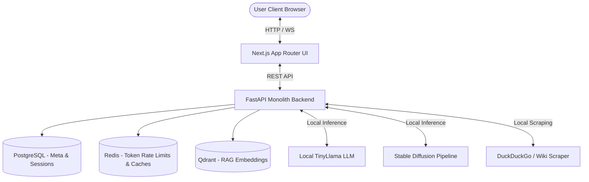
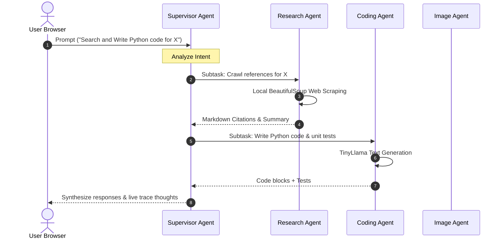

# System Architecture Blueprint

This document outlines the architectural block structure and data streaming paths of the 100% self-hosted Multimodal AI Platform.

## 1. High-Level Architecture Diagram

## 2. Multi-Agent Orchestration Workflow

When a user submits a prompt, the **Supervisor Agent** routes queries to specialized actors:

## 3. Deployment Scaling Strategy
- **Frontend Pods**: Horizontal scaling based on standard HTTP ingress volume.
- **Backend Pods**: Autoscales based on CPU/Memory and GPU limits. Node affinity schedules model pods to GPU nodes.
