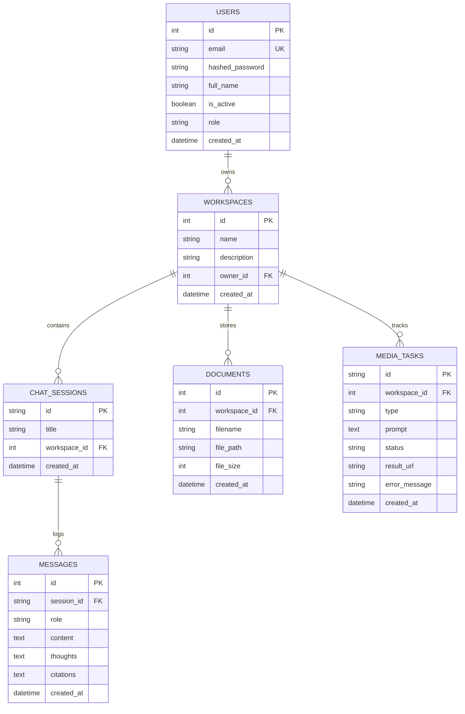

# Database Schema Documentation

This document describes the schema design for the PostgreSQL meta-data store.

## Entity-Relationship Schema

## Vector Store Schema (Qdrant)
The semantic search collection is configured as:
- **Collection Name**: `platform_docs`
- **Vector Dimension**: `384` (using local `all-MiniLM-L6-v2` transformer)
- **Distance Metric**: `Cosine`
- **Payload Indexing**:
  - `workspace_id`: Integer filtering index
  - `doc_id`: String UUID index
